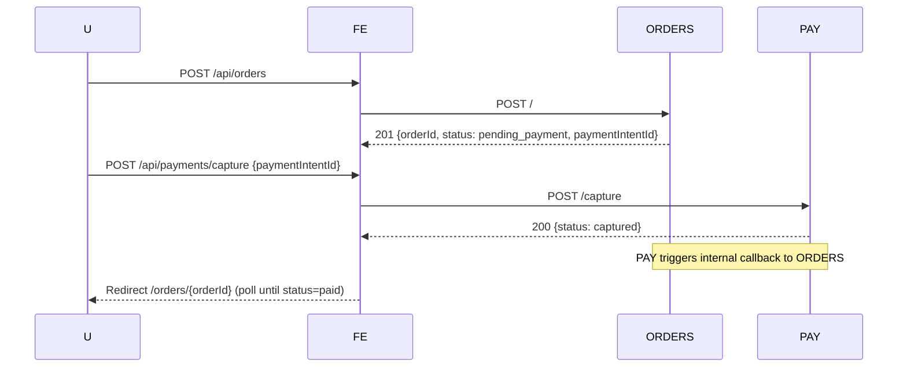
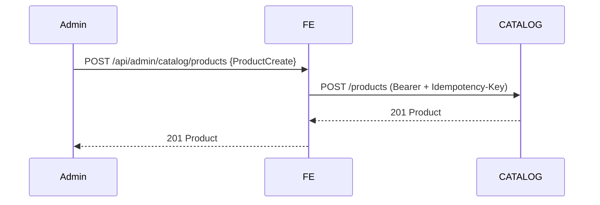

# Retail Hub — Storefront (Next.js) Technical Design

**Owner:** ACME Corp / Retail Hub  
**App:** `retail-hub-frontend`  
**Runtime:** Next.js 14 (App Router), TypeScript, Node 20  
**Deploy Target:** AWS ECS Fargate behind public ALB, TLS via ACM  
**Purpose:** Production‑grade storefront web app integrating all Retail Hub microservices

---

## 0. Goals & Non‑Goals

**Goals**
- Provide a first‑class, responsive storefront that covers: **signup, login, product browsing, cart, checkout, orders, payments confirmation, and reporting (admin)**.
- Integrate **all backend endpoints** defined by the OpenAPI specs for:
  - Accounts (`/v1/accounts`)
  - Catalog (`/v1/catalog`)
  - Cart (`/v1/cart`)
  - Orders (`/v1/orders`)
  - Payments (`/v1/payments`)
  - Reports (`/v1/reports`)
- Implement a **BFF layer** using Next.js Route Handlers to proxy calls, enforce cookies/headers, unify errors, and reduce CORS and token spillage.
- Ship with **serious UI**: accessible, responsive, consistent design tokens, and robust loading/error states.

**Non‑Goals (Phase 1)**
- Real payment processors (simulation only).
- Multi‑region HA. (App should not assume multi‑region.)
- Complex RBAC beyond “admin” vs “user”.

---

## 1. Information Architecture & Routes

Use Next.js **App Router** with the following route map:

```

/                         → Home (product grid; curated sections)
/login                    → Email/username + password form
/register                 → Signup form
/account                  → Profile view/edit (auth)
/catalog                  → Product grid with filters, sorting, pagination
/product/\[id]             → Product details with Add to Cart
/cart                     → Current user's cart, update qty, remove items
/checkout                 → One‑page checkout → creates order → capture payment → receipt
/orders                   → List my orders (auth)
/orders/\[orderId]         → Order detail & status (auth)
/reports                  → Admin: sales chart + table (auth + admin)
/admin/products           → Admin: products CRUD list (auth + admin)
/admin/products/new       → Admin: create product
/admin/products/\[id]/edit → Admin: update product
/\_health                  → UI health (local only)

```

**Navigation**
- Header: logo → `/`, search box, links: Catalog, Orders, Reports (admin only), Account (login/register vs avatar menu), Cart icon (badge).
- Footer: links (About, Terms), environment indicator (Dev/Staging/Prod).

---

## 2. Design System (tokens as CSS variables via Tailwind)

Adopt **Tailwind CSS** + **Radix UI primitives** (or headless equivalents) for accessibility. Define tokens in `app/globals.css` and `tailwind.config.ts`.

**Typography**
- Font: Inter (system fallback).
- Base size: 16px; scale: 14/16/18/20/24/30/36/48.
- Headings: `h1 36/44 bold`, `h2 30/38 semibold`, `h3 24/32 semibold`.

**Color Palette**
- `--color-bg: #0B0C10` (near‑black)
- `--color-surface: #121317`
- `--color-elev-1: #171922`
- `--color-text: #E6E8F0`
- `--color-muted: #AAB2C5`
- `--color-primary: #3B82F6` (blue‑500)
- `--color-primary-700: #1D4ED8`
- `--color-accent: #22D3EE` (cyan‑400)
- `--color-success: #10B981`
- `--color-warning: #F59E0B`
- `--color-danger: #EF4444`
- `--color-border: #2A2D3A`

**Spacing & Radius**
- 4‑pt grid: `4,8,12,16,24,32`
- Radius: `6px` (cards/buttons), `12px` (modals)
- Shadows: subtle, never overpower content.

**Component Library (to create)**
- Buttons (primary/secondary/ghost, loading state)
- Inputs/Textareas + labels + inline errors
- Select, Checkbox, Radio, Toggle
- Dialog/Modal (for confirmations)
- Toasts (success/error)
- Tabs (for admin pages)
- Skeleton loaders (grid item, list row)
- Card (product, order)
- DataTable (sortable)
- Pagination controls

**Accessibility**
- All interactive components keyboard navigable (Tab/Shift+Tab, Enter/Space, Esc).
- Proper ARIA labels/roles; visible focus states; color contrast ≥ 4.5:1 on text.

---

## 3. State, Data Fetching & Caching

- Use **TanStack Query** for client data fetching & cache (cart, orders history).
- SSR for SEO‑critical pages (home, catalog, product).
- **BFF pattern:** All API calls go through Next.js **Route Handlers** under `/app/api/**`, which:
  - Forward `Authorization` via server‑side cookie (`rh_session`).
  - Generate and attach `X-Request-Id` and `Idempotency-Key` when needed.
  - Normalize errors to RFC‑9457 Problem JSON.

**Token storage**
- Authenticate via Accounts → receive JWT.
- Next BFF sets `rh_session` cookie: `Domain=.retail-hub.com; Path=/; HttpOnly; Secure; SameSite=Lax; Max-Age=86400`.

---

## 4. Environment & Configuration

`.env.example`
```

# Base URLs to microservices (dev defaults)

NEXT\_PUBLIC\_SITE\_BASE\_URL=[http://localhost:3000](http://localhost:3000)

ACCOUNTS\_BASE\_URL=[http://localhost:8080/v1/accounts](http://localhost:8080/v1/accounts)
CATALOG\_BASE\_URL=[http://localhost:8081/v1/catalog](http://localhost:8081/v1/catalog)
CART\_BASE\_URL=[http://localhost:8082/v1/cart](http://localhost:8082/v1/cart)
ORDERS\_BASE\_URL=[http://localhost:8083/v1/orders](http://localhost:8083/v1/orders)
PAYMENTS\_BASE\_URL=[http://localhost:8084/v1/payments](http://localhost:8084/v1/payments)
REPORTS\_BASE\_URL=[http://localhost:8085/v1/reports](http://localhost:8085/v1/reports)

# Cookie/session

SESSION\_COOKIE\_NAME=rh\_session
SESSION\_MAX\_AGE=86400

# UI

NODE\_ENV=development
LOG\_LEVEL=info

```

**Prod deploy values**
```

ACCOUNTS\_BASE\_URL=[https://api.retail-hub.com/v1/accounts](https://api.retail-hub.com/v1/accounts)
CATALOG\_BASE\_URL=[https://api.retail-hub.com/v1/catalog](https://api.retail-hub.com/v1/catalog)
CART\_BASE\_URL=[https://api.retail-hub.com/v1/cart](https://api.retail-hub.com/v1/cart)
ORDERS\_BASE\_URL=[https://api.retail-hub.com/v1/orders](https://api.retail-hub.com/v1/orders)
PAYMENTS\_BASE\_URL=[https://pay.retail-hub.com/v1/payments](https://pay.retail-hub.com/v1/payments)
REPORTS\_BASE\_URL=[https://reports.retail-hub.com/v1/reports](https://reports.retail-hub.com/v1/reports)

```

---

## 5. Directory Structure

```

/app
/(public)              # Layout with header/footer
/login
/register
/catalog
/product/\[id]
/cart
/checkout
/orders
/orders/\[orderId]
/account
/reports               # admin only
/admin/products
/admin/products/new
/admin/products/\[id]/edit
/api                   # BFF route handlers (proxy to services)
/auth/login
/auth/register
/auth/logout
/cart/...
/catalog/...
/orders/...
/payments/...
/reports/...
/components              # UI components
/lib
api-client.ts          # fetch wrapper (server/client aware)
idempotency.ts         # key generation
request-id.ts          # uuid v4
auth.ts                # cookie helpers; user decoding
validators.ts          # zod schemas for forms
currency.ts            # formatters
/styles
/tests

````

---

## 6. API Integration (BFF) — Contract Mapping

**General headers**
- Add `X-Request-Id: <uuidv4>` to every request.
- For mutating requests: `Idempotency-Key: <uuidv4>`.

**Accounts**
- `POST /auth/register` → `/api/auth/register`
- `POST /auth/login` → `/api/auth/login`  
  - BFF exchanges credentials with Accounts service; on 200:
    - Set cookie `rh_session=<jwt>` with attributes above.
    - Return sanitized user payload.
- `POST /auth/logout` → `/api/auth/logout`  
  - BFF clears `rh_session` cookie and calls Accounts logout for parity.
- `GET /users/me` → `/api/auth/me`  
  - BFF forwards cookie to Accounts and returns user.

**Catalog**
- `GET /products` → `/api/catalog/products` (public SSR)
- `GET /products/{id}` → `/api/catalog/products/[id]` (public SSR)
- Admin:
  - `POST /products` → `/api/admin/catalog/products`
  - `PUT /products/{id}`, `DELETE /products/{id}`

**Cart** (auth required)
- `GET /` → `/api/cart`
- `POST /items` → `/api/cart/items` (idempotent upsert)
- `PUT /items/{itemId}` → `/api/cart/items/[itemId]`
- `DELETE /items/{itemId}` → `/api/cart/items/[itemId]`
- `DELETE /` → `/api/cart`

**Orders** (auth required)
- `POST /` → `/api/orders`  
  - Creates order from current cart. Expect status `pending_payment` (or `paid` in simulation).
  - Response may include `paymentIntentId`.
- `GET /{orderId}` → `/api/orders/[orderId]`
- `GET /` → `/api/orders`

**Payments** (auth required for end‑user)
- `POST /intents` (normally created by Orders; keep button in **dev tools panel**)
- `POST /capture` with `paymentIntentId` (from created order)
- `GET /intents/{intentId}`
- `POST /intents/{intentId}/cancel` (dev tool)

**Reports** (admin only)
- `GET /sales?from=&to=` → `/api/reports/sales`
- `GET /sales.csv?from=&to=` → `/api/reports/sales.csv` (download)

---

## 7. UX Flows (Mermaid)

**Login / Register**
```mermaid
sequenceDiagram
  participant U as User
  participant FE as Next.js BFF
  participant ACC as Accounts API
  U->>FE: POST /api/auth/login {usernameOrEmail, password}
  FE->>ACC: POST /auth/login
  ACC-->>FE: 200 {token, user}
  FE-->>U: Set-Cookie rh_session=<jwt> (Domain=.retail-hub.com)
````

**Add to Cart**

```mermaid
sequenceDiagram
  U->>FE: POST /api/cart/items {productId, qty}
  FE->>CART: POST /items (Bearer via rh_session)
  CART-->>FE: 201 Cart
  FE-->>U: 201 Cart
```

**Checkout (Order + Payment Capture)**



**Admin product CRUD**



---

## 8. Pages — Detailed Behavior & UI

### `/login`

* Two fields: **Username or Email**, **Password**; “Remember me” toggles cookie `Max‑Age` (24h vs session).
* Validate (zod): non‑empty, password ≥ 8 chars.
* On submit: POST `/api/auth/login`. On success redirect to last intended route or `/`.
* Errors: Show RFC‑9457 `detail`.

### `/register`

* Fields: Username, Email, Password, Confirm password.
* POST `/api/auth/register` → on 201, auto‑login (call `/api/auth/login`) and redirect.
* Conflict 409 → inline errors on username/email.

### `/account` (auth)

* Fetch `/api/auth/me` SSR, display profile (given/family name, email).
* Update via `PUT /users/me` (email/profile fields).
* If profile contains `role=admin`, show Admin navigation items.

### `/catalog`

* SSR (**revalidate: 60s**). Query params: `query, category, minPriceCents, maxPriceCents, sort, page, size`.
* Grid (3–4 columns desktop). Each card: image placeholder, name, price, CTA **Add to Cart** (if auth) or **Sign in to add**.
* Filters in left sidebar or top bar on mobile (disclosure).

### `/product/[id]`

* SSR; show fields: name, description, price, inventory indicator.
* “Add to Cart” with qty stepper (1..10). On click → `/api/cart/items`.

### `/cart` (auth)

* Client (TanStack Query). Display items, per‑line qty adjust, remove, and **Proceed to Checkout**.
* Disabled checkout if cart empty.

### `/checkout` (auth)

* One page:

  * Shipping address form (optional fields; client‑side only for now).
  * Order summary (items + totals).
  * Button **Place Order**:

    * POST `/api/orders` with idempotency key.
    * If response has `paymentIntentId`, auto call `/api/payments/capture`.
    * Navigate to `/orders/[orderId]` with status updates (poll `/api/orders/[id]` until `paid` or `failed`).
* Show inline errors on conflicts (e.g., inventory changed).

### `/orders` (auth)

* Paginated list with status chip (pending\_payment/paid/cancelled/failed). Link to detail.

### `/orders/[orderId]` (auth)

* Show immutable snapshot: items, totals, status timeline.
* If `pending_payment`, display retry capture button.

### `/reports` (admin)

* Date range picker → fetch `/api/reports/sales`.
* Line chart (daily revenue), table (date, total orders, total revenue).
* Export button → download `/api/reports/sales.csv`.

### `/admin/products` (admin)

* Table with search, sort by createdAt/price/sku; actions: Edit/Delete.
* Delete confirmation modal.

### `/admin/products/new` & `/admin/products/[id]/edit`

* Form: name, description, sku, priceCents, category, inventoryQty (zod validation).
* Submit to BFF → Catalog create/update.

---

## 9. Authentication & Authorization

* Source of truth: **Accounts**.
* Cookie `rh_session` contains JWT; **never expose token to client JS** (httpOnly cookie).
* **BFF validates presence**; for SSR pages, read cookie in `headers()` and forward to services.
* **Admin gating**: display admin UI when `user.profile.role === "admin"`. Backend must still enforce.

**Logout**

* `/api/auth/logout` clears cookie and calls Accounts logout.

---

## 10. Errors, Loading, Empty States

* Show skeletons for grid/list detail.
* Normalize all service errors to:

```json
{ "title": "...", "status": 400, "detail": "..." }
```

* Toast on success/error; inline on forms.
* 401 → redirect to `/login?next=…`.
* 409 (conflict) → show actionable copy (e.g., “Inventory changed; please review your cart”).

---

## 11. Idempotency & Request IDs

* `Idempotency-Key`: generate `uuidv4()` per **user‑initiated** POST (register, login optional, add‑to‑cart, create order, capture).
* `X-Request-Id`: every request; echo in logs.

---

## 12. Security

* **HTTPS only**.
* Cookie: `HttpOnly; Secure; SameSite=Lax; Domain=.retail-hub.com; Path=/`.
* CSRF: BFF only accepts **same‑site** requests; for extra defense, add a CSRF cookie+header for mutating BFF endpoints (double‑submit token).
* Never store secrets client‑side.

---

## 13. Analytics & Telemetry

* Add a minimal custom event bus:

  * `product_view`, `add_to_cart`, `order_created`, `order_paid`, `login`, `register`.
* Emit `X-Request-Id` with events to correlate with backend logs.

---

## 14. OpenAPI Types & Client Utilities

* Copy API specs into `openapi/` (keep in sync).
* Use `openapi-typescript` to generate types:

  * `pnpm dlx openapi-typescript openapi/accounts.yaml -o src/types/accounts.d.ts`
  * Repeat for all services.
* Implement a typed `fetchJson<T>` with runtime zod validation for critical responses.

---

## 15. Testing

* **Unit:** components, utils (zod validators, currency).
* **Integration:** BFF route handlers (mock service responses).
* **E2E:** Playwright flows:

  1. Register → Login
  2. Browse catalog → Add to cart → Checkout → Paid
  3. Admin: create product → verify appears in catalog
  4. Reports: date range JSON + CSV

---

## 16. Build & Deploy

* **Dockerfile**: Multi‑stage Node 20, `next build`, run with `next start`.
* **Health check**: expose `/api/healthz` (BFF) that returns `{ "status": "ok" }`.
* ECS task env vars: all `*_BASE_URL` + cookie config.

---

## 17. Acceptance Criteria (Go/No‑Go)

* All routes render and interoperate with live services under `retail-hub.com` subdomains.
* Checkout reliably reaches **paid** in `always_approve` simulation.
* Admin can CRUD products; non‑admin cannot access admin routes.
* Reports render chart + table and export CSV.

---

## 18. Implementation Checklist (Cursor)

1. Scaffold Next.js 14 (App Router, TS, Tailwind, Radix, TanStack Query).
2. Implement Design Tokens and base components.
3. Create BFF route handlers for **all** API endpoints listed.
4. Build auth flows and cookie handling.
5. Implement pages and hooks in §8.
6. Add idempotency/request‑id utilities.
7. Generate OpenAPI types and wire client helpers.
8. Add tests and CI workflow.
9. Build Docker image; provide ECS task/service JSON/YAML in `/deploy`.
